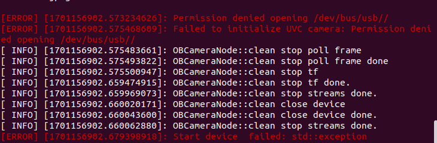

# Astra S使用简介
参考链接：https://blog.csdn.net/cau_weiyuhu/article/details/128533386

主要步骤：

1. 下载源码编译，具体细节见参考连接
```
cd ~/AstraS_ws/src
git clone https://github.com/orbbec/ros_astra_camera

```


注意：
1. launch文件
```
roslaunch astra_camera astra.launch
```

2. 启动launch后报错


解决：启动前需要确保 USB 设备的权限设置正确。你可以尝试更改设备文件的权限，使其对用户可读写。
```
sudo chmod a+rw /dev/bus/usb/*/*
```